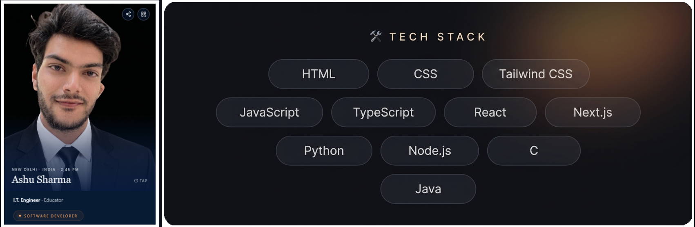

 
 
<!-- Typing animation -->

  
 

 
 

   <a href="#">
  

<!-- Width ko percentage me rakha hai taaki profile page par images upar-neeche wrap na hon -->

   <a href="#">
  

 

<table width="100%">
<tr>
<td width="33.33%" valign="top">

### 🌱 Currently

🔨 Building my personal portfolio  
📚 Learning advanced SDE + Tableau & Power BI  
💡 Exploring Ocean  
🐛 Fighting unexpected bugs

</td>
<td width="33.33%" valign="top">

### 🚀 Projects

- **Temporary Mail Bot**  
  Telegram temporary email generator.

- **Gurgaon Real Estate**  
  Property price prediction system.

- **Globble Converter**  
  Real-time Oil & Gas unit converter.

</td>
<td width="33.33%" valign="top">

### ⚡ Fun Facts

☕ Coffee • Tea • Softy  
🎮 Chess • Minecraft  
🎵 Alan Walker — *On My Way*  
🐕 Dogs • 🐎 Horses  
🌙 Night-time coder  
🧠 Too many ideas

</td>
</tr>
</table>

### 📫 Connect

 

<!-- Social Media Badges Row -->

  
  
  
  

 

<a href="#">

