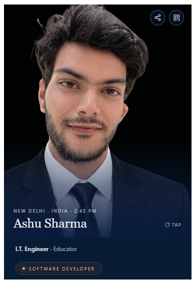
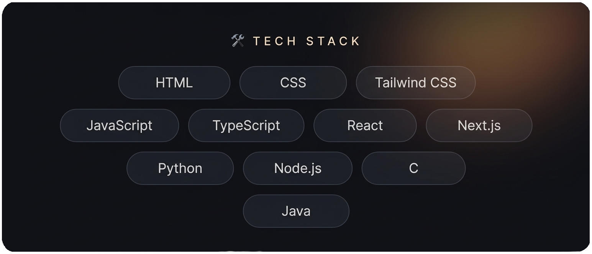

  

 

# The best way to predict the future is to build it. 🐎

> I like building things, breaking things, and turning random ideas into projects.

 

<!-- Dono ki height same fix kar di hai (250). Isse alignment perfect rahega -->

  
  &nbsp;&nbsp;&nbsp;&nbsp;
  

 

<table width="100%">
<tr>
<td width="33%" valign="top">

### 🌱 Currently

🔨 Building my personal portfolio  
📚 Learning advanced SDE + Tableau & Power BI  
💡 Exploring Real Estate & Sales  
🐛 Fighting unexpected bugs

</td>
<td width="33%" valign="top">

### 🚀 Projects

- **Temporary Mail Bot**  
  Telegram temporary email generator.

- **Gurgaon Real Estate**  
  Property price prediction system.

- **Globble Converter**  
  Real-time Oil & Gas unit converter.

</td>
<td width="33%" valign="top">

### ⚡ Fun Facts

☕ Coffee • Tea • Softy  
🎮 Chess • Minecraft  
🎵 Alan Walker — *On My Way*  
🐕 Dogs • 🐎 Horses  
🌙 Night-time coder  
🧠 Too many ideas

</td>
</tr>
</table>

### 📫 Connect

🌐 **Portfolio:** Coming Soon  
💼 **LinkedIn:** [globble](https://www.linkedin.com/in/globble/)  
📧 **Email:** Globble@yahoo.com

> *Build things you're excited about.* 🚀
